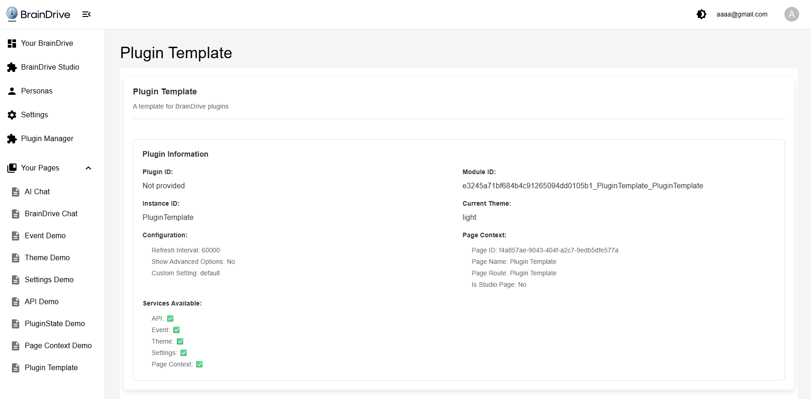

# BrainDrive Plugin Development Template

This template serves as a starting point for [BrainDrive](https://github.com/BrainDriveAI/BrainDrive) plugin development, providing:

- Comprehensive error handling patterns and utilities
- Proper BrainDrive service integration
- React component architecture with error boundaries
- TypeScript type definitions and interfaces
- Development tools and debugging utilities
- Production-ready code structure and patterns

Use with the [Plugin Developer Quickstart Guide](https://docs.braindrive.ai/core/plugin-development/quickstart) to begin developing BrainDrive plugins in 30 minutes or less. 

## Plugin Template Demo



## What's Included

### Core Components

1. **Main Plugin Component** (`PluginTemplate.tsx`) - Enhanced with comprehensive error handling
2. **Error Boundary** (`ErrorBoundary.tsx`) - React error boundary with recovery mechanisms
3. **Error Display** (`ErrorDisplay.tsx`) - User-friendly error display with actions
4. **Loading Spinner** (`LoadingSpinner.tsx`) - Consistent loading state component
5. **Settings Example** (`SettingsExample.tsx`) - Template for plugin configuration

### Error Handling System
- **Custom Error Types** - Specific error classes for different scenarios
- **Error Handler Utility** - Centralized error management with multiple strategies
- **Service Integration** - Error-safe service initialization and usage
- **User Experience** - Clear error messages and recovery options

### Development Tools
- **TypeScript Definitions** - Complete type safety for BrainDrive APIs
- **Utility Functions** - Enhanced utilities with error handling
- **Documentation** - Comprehensive guides and examples
- **Testing Patterns** - Error handling test examples

## Getting Started

### Prerequisites

- [BrainDrive](https://github.com/BrainDriveAI/BrainDrive) Platform
- Node.js 16+ and npm/yarn
- BrainDrive development environment
- Basic knowledge of React and TypeScript

### Setup
1. **Copy the template** to your new plugin directory
2. **Customize the plugin metadata**:
   ```bash
   # Update package.json with your plugin details
   # Update lifecycle_manager.py with your plugin information and module definitions
   ```
3. **Install dependencies**:
   ```bash
   npm install
   ```
4. **Build the plugin**:
   ```bash
   npm run build
   ```

### Customization Checklist
- [ ] Update `package.json` name, description, and version
- [ ] Customize `lifecycle_manager.py` plugin and module data ([see guide](references/LIFECYCLE_MANAGER_CUSTOMIZATION_GUIDE.md))
- [ ] Replace template components with your functionality
- [ ] Update error types and handling for your use cases ([see guide](https://github.com/BrainDriveAI/PluginTemplate/blob/main/DEVELOPER_GUIDE.md))
- [ ] Add your specific service integrations ([see examples](https://docs.braindrive.ai/services/intro)
- [ ] Write tests for your plugin functionality

Need help? Check our [comprehensive documentation](https://docs.braindrive.ai) or visit [community.braindrive.ai](https://community.braindrive.ai/)

## Plugin Structure
```
src/
├── components/           # React components
│   ├── ErrorBoundary.tsx    # Error boundary component
│   ├── ErrorDisplay.tsx     # Error display component
│   └── index.ts             # Component exports
├── services/            # Business logic services
│   └── PluginService.ts     # Main service with error handling
├── utils/              # Utility functions
│   ├── errorHandling.ts     # Error handling utilities
│   └── utils.ts             # General utilities
├── types.ts            # TypeScript definitions
└── PluginTemplate.tsx  # Main plugin component
```

## Learning Resources

### Documentation
- **[Developer Guide](DEVELOPER_GUIDE.md)** - Comprehensive implementation guide
- **[Error Handling Guide](ERROR_HANDLING_GUIDE.md)** - Detailed error handling reference
- **[Lifecycle Manager Customization Guide](references/LIFECYCLE_MANAGER_CUSTOMIZATION_GUIDE.md)** - Complete guide for customizing lifecycle_manager.py

### Lifecycle Manager References
- **[Lifecycle Manager Reference](references/Lifecycle-Manager-Reference.md)** - Complete lifecycle manager architecture and function reference
- **[Plugin Data Field Reference](references/Plugin-Data-Field-Reference.md)** - Detailed reference for all plugin_data fields
- **[Module Data Field Reference](references/Module-Data-Field-Reference.md)** - Comprehensive guide to module_data configuration

### Additional Resources
- **Inline Comments** - Extensive code documentation and TODOs

## Troubleshooting

### Common Issues
- **Build errors**: Check TypeScript types and imports
- **Service integration**: Verify BrainDrive services are available
- **Error handling**: Ensure error boundaries are properly configured

### Debug Tips
- Use the enhanced error display for debugging
- Check browser console for detailed error logs
- Use the error handler statistics for monitoring
- Enable development mode for additional debugging info

## Contributing

When contributing to this template:
1. Maintain backward compatibility
2. Add comprehensive error handling to new features
3. Update documentation for any changes
4. Include tests for new functionality
5. Follow the established code patterns

## Full Project Documentation Index

[BrainDrive Documentation](https://docs.braindrive.ai)

## Questions?

Post at [community.braindrive.ai](https://community.braindrive.ai). We're here to build the future of user-owned AI together. 

## License

[MIT Licensed](LICENSE) - BrainDrive is built for your ownership & freedom. Your AI. Your Rules. 


